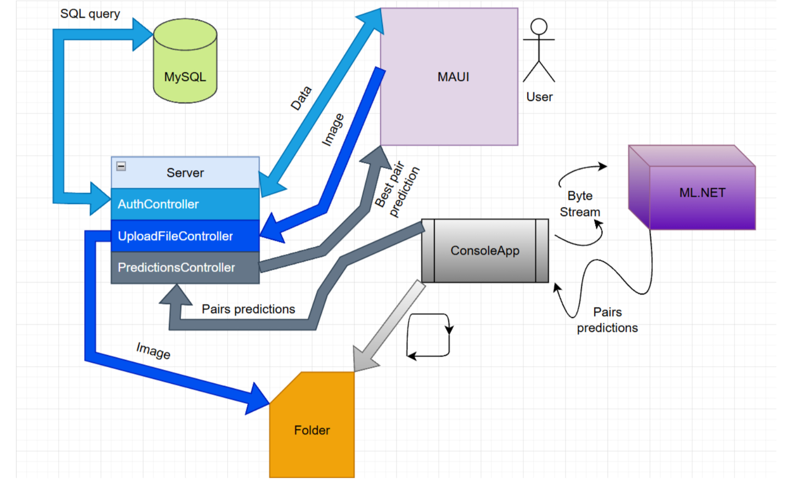

# PriceGO

**Author:** Daniil Yuzepenko  
**Email:** [georgiferstor@gmail.com](mailto:georgiferstor@gmail.com)  
**Phone:** +48 790 803 659  

## Project Overview

**PriceGO** is a mobile application similar to Google Lens. It allows users to take photos of technical devices, recognizes them using ML.NET, and returns predictions.

The project is fully developed in C# using:
- .NET MAUI (Frontend)
- ASP.NET Core (Backend)
- ML.NET (Machine Learning)
- MySQL (Database)

---

## Architecture Diagram

---

## System Components

### Server (ASP.NET Core)
Runs locally on a hotspot network, accessible to all devices connected to the host. It includes the following API controllers:

- **AuthController** – Handles user login and registration.
- **UploadFileController** – Handles image uploads from the client to the server.
- **PredictionsController** – Retrieves predictions from the console ML app and returns them to the MAUI client.

### Client (MAUI.NET)
Functionality includes:
- User authentication (login/register)
- Camera view and gallery image picker
- Sending images to the server
- Fetching predictions from the backend

---

## Workflow

1. The user takes a photo or selects one from the gallery.
2. The image is saved locally and sent to the server using the `Send_to_API()` method.
3. The image is uploaded via `UploadFileController`.
4. The server saves the file and notifies the console application.
5. The console app, using ML.NET, analyzes the image and generates predictions.
6. Results are posted back to `PredictionsController`.
7. The MAUI app fetches results using a GET request (only after POST completes).

---

## Technologies Used

- **.NET MAUI** – Cross-platform UI
- **ASP.NET Core** – Backend server and API
- **ML.NET** – Machine Learning pipeline
- **MySQL** – Relational database
- **CameraView** – Third-party camera component

---

## Challenges Faced

1. Attempted ML.NET integration directly on Android – limited resources and documentation.
2. Camera issues with built-in `Camera.MAUI`, switched to `CameraView` library.
3. Inconsistencies between `MediaPicker` and `CameraView` (stream vs. file stream).
4. Uncatchable exceptions with async capture method on Android.

---

## Future Plans

Planned features include:
- E-commerce integration (e.g., MediaExpert, MediaMarkt)
- Custom online store suggestions based on image recognition results

---

## Project Status

The app’s core logic and architecture are in place. Product suggestion and pricing integration are planned for future versions.

---

## Contact

For questions or contributions, feel free to reach out:

**Email:** [georgiferstor@gmail.com](mailto:georgiferstor@gmail.com)  
**Phone:** +48 790 803 659
